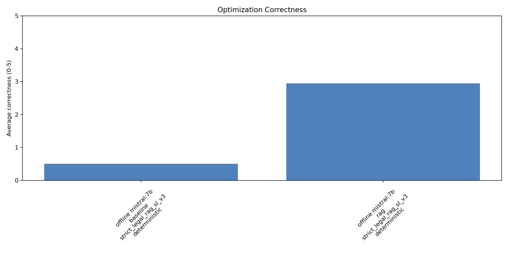
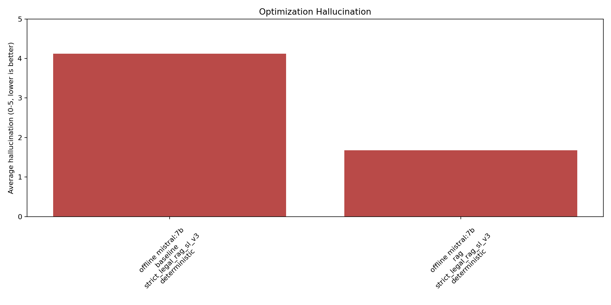
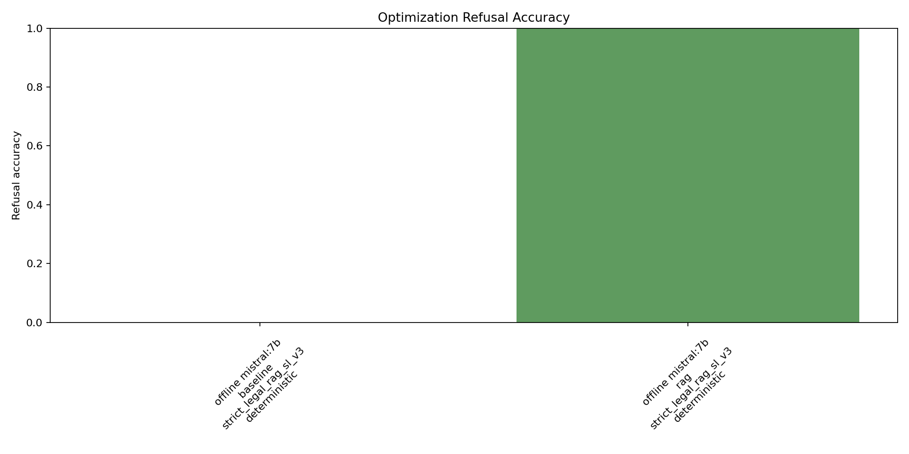

# Correctness Optimization Results

These results are separate from the main reproducible evaluation. They compare system prompts and generation settings for model optimization.

## Best RAG Configurations

| model_id | variant | prompt_id | settings_id | n | correctness | grounding | completeness | clarity | hallucination | supported_citation_rate | refusal_accuracy |
| --- | --- | --- | --- | --- | --- | --- | --- | --- | --- | --- | --- |
| offline-webui-mistral-7b | rag | strict_legal_rag_sl_v3 | deterministic | 40 | 2.95 | 4.83 | 2.95 | 4.85 | 1.68 | 1.00 | 1.00 |

## Full Summary

| model_id | variant | prompt_id | settings_id | n | correctness | grounding | completeness | clarity | hallucination | supported_citation_rate | refusal_accuracy |
| --- | --- | --- | --- | --- | --- | --- | --- | --- | --- | --- | --- |
| offline-webui-mistral-7b | baseline | strict_legal_rag_sl_v3 | deterministic | 40 | 0.50 | 0.12 | 0.50 | 5.00 | 4.12 | 0.00 | 0.00 |
| offline-webui-mistral-7b | rag | strict_legal_rag_sl_v3 | deterministic | 40 | 2.95 | 4.83 | 2.95 | 4.85 | 1.68 | 1.00 | 1.00 |

## Retrieval

- Answerable hit rate: 1.000
- Unanswerable false evidence rate: 0.000
- Average context length: 448.6 words

## Charts

CSV tables:

- [optimization_summary.csv](optimization_summary.csv)
- [optimization_retrieval_summary.csv](optimization_retrieval_summary.csv)
