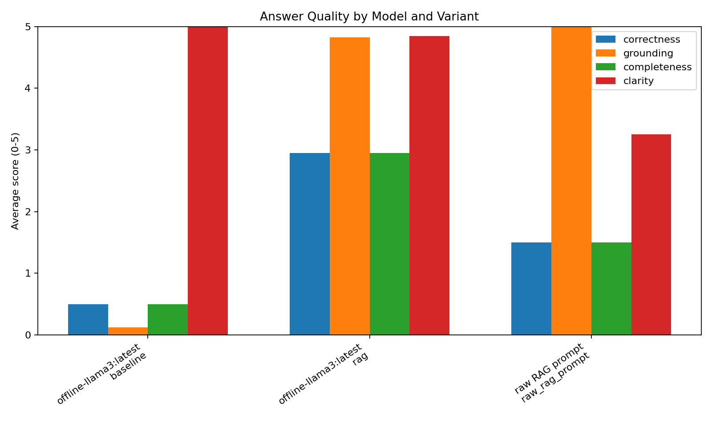
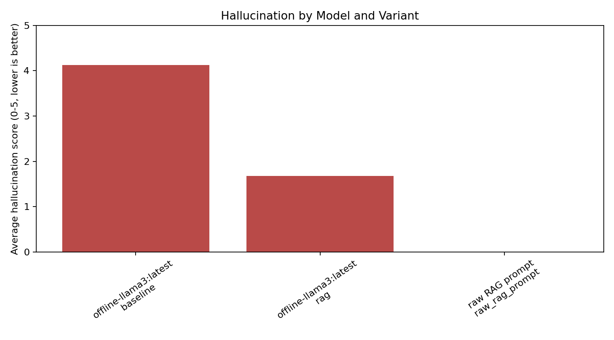
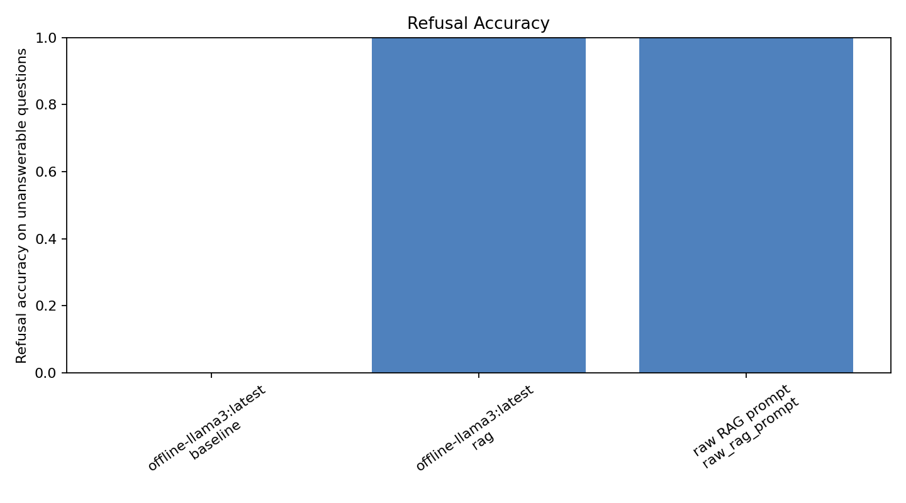
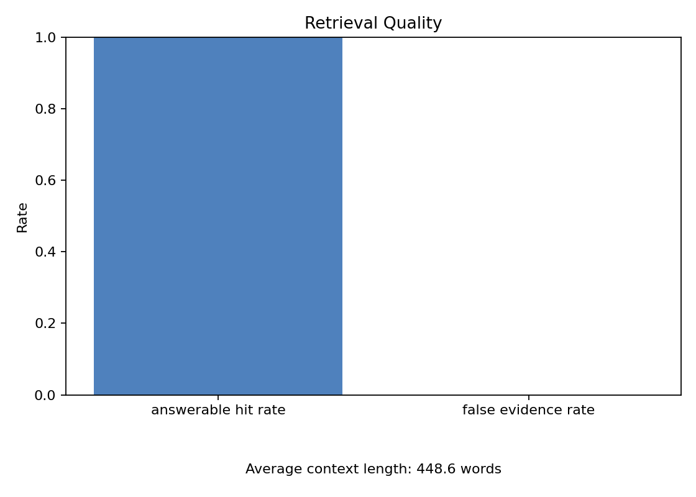

# Evaluation Results

## Answer Scores

| model_id | model_label | variant | n | correctness | grounding | completeness | clarity | hallucination | supported_citation_rate | refusal_accuracy |
| --- | --- | --- | --- | --- | --- | --- | --- | --- | --- | --- |
| offline-llama3:latest | offline-llama3:latest | baseline | 40 | 0.50 | 0.12 | 0.50 | 5.00 | 4.12 | 0.00 | 0.00 |
| offline-llama3:latest | offline-llama3:latest | rag | 40 | 2.95 | 4.83 | 2.95 | 4.85 | 1.68 | 1.00 | 1.00 |
| raw-rag-prompt | raw RAG prompt | raw_rag_prompt | 40 | 1.50 | 5.00 | 1.50 | 3.25 | 0.00 | 0.00 | 1.00 |

## Retrieval

- Answerable hit rate: 1.000
- Unanswerable false evidence rate: 0.000
- Average context length: 448.6 words

## Charts

SVG: [summary_scores.svg](summary_scores.svg)
JPG: [summary_scores.jpg](summary_scores.jpg)

SVG: [hallucination_by_model.svg](hallucination_by_model.svg)
JPG: [hallucination_by_model.jpg](hallucination_by_model.jpg)

SVG: [refusal_accuracy.svg](refusal_accuracy.svg)
JPG: [refusal_accuracy.jpg](refusal_accuracy.jpg)

SVG: [retrieval_quality.svg](retrieval_quality.svg)
JPG: [retrieval_quality.jpg](retrieval_quality.jpg)

CSV tables:

- [summary_scores.csv](summary_scores.csv)
- [retrieval_summary.csv](retrieval_summary.csv)
